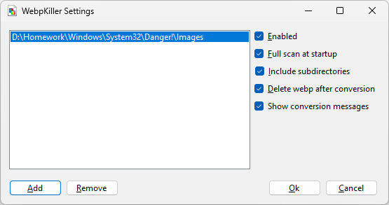

# WebpKiller

Application that monitors given folders and automatically converts all webp files into jpeg format

## Building

This application needs .NET 10 SDK. Should build as-is. Open a terminal in the directory that contains the csproj file,
then execute `dotnet build -c Release`

The exe will be in the `bin\Release` folder

## Dependencies

This application needs the .NET 10 **Desktop** Runtime:
https://dotnet.microsoft.com/en-us/download/dotnet/10.0

## Usage

This utility is of the "double click and go" type.
Simply double click the executable to run it.
If you don't have any folders configured yet, the settings window is automatically shown,
otherwise it starts in the background without showing anything.
You can only run one instance at a time per user.
If a copy is already running, its settings window will be shown.

Use the tray icon to bring up the settings dialog or exit the application.

## Settings

The settings window allows you to configure monitored directories.
Each directory has its individual set of monitoring options.

**Do not monitor too broadly**,
for example, do not just add the `C:` drive into the list.
Not only is this going to affect monitoring performance,
the startup scan (if enabled) is going to take a long time,
and the application may also convert webp files that have been temporarily written to disk
or are used by other programs.

You should monitor as restrictive as possible,
for example your download and images directories.

### Folder option: Enabled

This checkbox enables or disables a setting.
Allowing you to disable them without having to remove them.

### Folder option: Full scan at startup

If enabled, the supplied folder is scanned for existing webp files during startup,
which are then converted.

This scan is only performed during application start,
never by adding a folder or by changing this value.

The automatic scan will run in the background,
and is limited by the number of CPU codes (minus one) of your system.
Files converted this way will not trigger the conversion notification.
This setting respects the "Enabled", "Include subdirectories", and "Delete webp after conversion" settings.

### Folder option: Include subdirectories

If enabled, the application will also check for webp files in all subdirectories of the specified folder.

### Folder option: Delete webp after conversion

If enabled, the webp file is deleted after conversion.
Even if enabled, the file is only deleted if Image Magick exited with a success code.

### Folder option: Show conversion messages

This shows a popup in your notification area for every file that was converted,
or failed to convert.

There is a global cooldown, and you will see at most one message every 5 seconds.

## Autostart

The application doesn't comes with this built-in but you can do it yourself fairly easily:

1. Open the "run" dialog (Using `[WIN]`+`[R]` key combination or by right clicking on the start button)
2. Type `shell:startup` into the box and hit ENTER
3. Drag the WebpKiller.exe into the window using the **right** mouse button
4. Select "Create shortcut here" from the context menu
5. Close the explorer Window agaion

To disable autostart, simply delete the shortcut.
